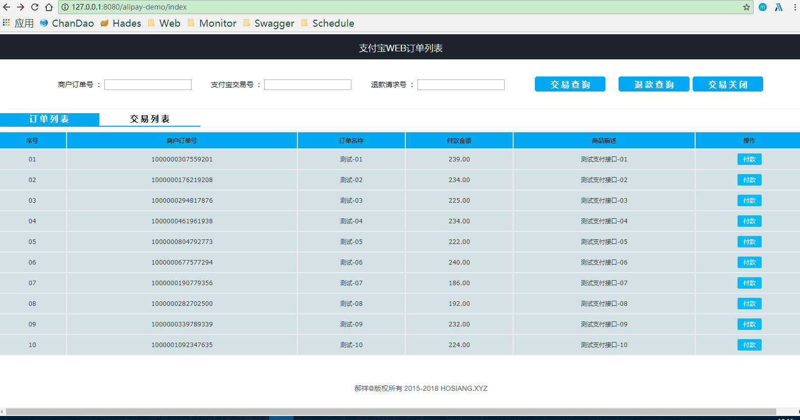

# alipay-demo （支付宝支付接口使用）

## 作者：吉祥草

## 网站：http://www.hosiang.ml （狂欢马克思）

## 说明：

### SpringBoot框架，Java调用支付宝电脑网站支付接口，完成付款功能，沙箱环境具体开发，请参考蚂

### 蚁金服官方提供的开发接口文档

## 本地访问：http://localhost:8080/alipay-demo/index

## 效果演示：

